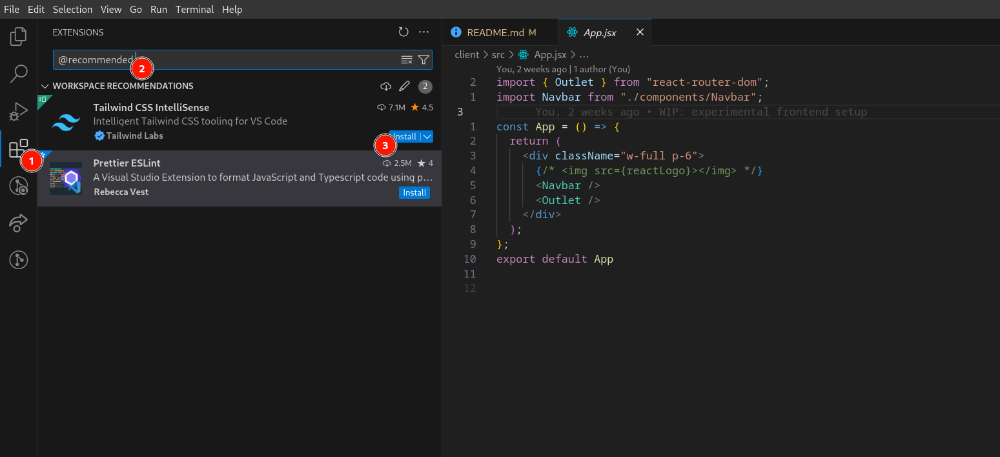

# Each One Teach One

Each one Teach one is a social web platform that allows users to exchange knowledge based on their skills and interests. Each individual becomes both the teacher and the student.

## Table of Contents

- [Each One Teach One](#each-one-teach-one)
  - [Table of Contents](#table-of-contents)
  - [Installation](#installation)
    - [Prerequisites](#prerequisites)
    - [Setup](#setup)
  - [Usage](#usage)
  - [Configuration](#configuration)
    - [Use Prettier ESlint in the client folder](#use-prettier-eslint-in-the-client-folder)
    - [Setting Up `config.env`](#setting-up-configenv)
  - [Contributing](#contributing)
  - [License](#license)

## Installation

### Prerequisites

Ensure you have the following installed on your local machine :

- Node.js (version 22.4.1 or above)
- npm (version 10.8.2 or above) or yarn (version X.X.X)
- MongoDB (version X.X.X)

### Setup

1. Clone the repository:

   ```sh
   git clone git@github.com:kamilbeehus/eachOneTeachOne.git
   cd eachOneTeachOne
   ```

2. Install dependencies for the backend:

   ```sh
   cd server
   npm install
   ```

3. Install dependencies for the frontend:

   ```sh
   cd client
   npm install
   ```

4. Start MongoDB:

   ```sh
   mongod
   ```

5. Start the backend server:

   ```sh
   cd server
   npm start
   ```

   or

   ```sh
   cd server
   node --watch server.js
   ```

6. Start the frontend development server:
   ```sh
   cd client
   npm run dev
   ```

## Usage

\*\*For future instructions on how to use the project. This could include how to run tests, any specific commands that need to be executed, or usage examples.

## Configuration

### Use Prettier ESlint in the client folder
1. Open up a terminal 
2. Type in `pwd` (print working directory) to make sure you're in the `best_project` folder
3. Type in `git pull` to make sure you're on the latest commit
3. Type in `cd .vscode`
4. Type in `cp settings.example.json settings.json` this will make a copy of settings.example.json and rename it to settings.json
5. If you don't already have the recommended vscode extensions installed, open the extensions tab in the left panel (1), then type `@recommended` (2) and finally click on the install buttons (3)



### Setting Up `config.env`

1. Create a file named `.env` in the server directory of your project.

2. Add your MongoDB Atlas connection string and the Port for connection to the `.env` file in the following format:

   ```env
   PORT=5050
   MONGO_URI=your_mongodb_atlas_connection_string
   ```

   Replace `your_mongodb_atlas_connection_string` with your actual MongoDB Atlas connection string.

3. Ensure that the `.env` file is included in your `.gitignore` file to prevent it from being committed to your repository:

   ```sh
   echo ".env" >> .gitignore
   ```

## Contributing

\*\*Guidelines for contributing to the project in case we decide to make it open source in the future.

## License

\*\*We should include a license as soon as we make the repository public.

```

```
